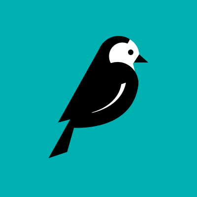

## I'm

Full Stack Web Developer

## Languages

<table  align="center">
  <tr>
    
        🇺🇦 Ukrainian - Native
        
  </tr>

  <tr>
    
        🇬🇧 English - Upper intermediate
        
  </tr>

</table>

## My stack and tools:

<table align="center">
  <tr>
     <td align="center"  width="88">
         
       HTML5
    </td>
    <td align="center" width="88">
        
       CSS3
    </td>
    <td align="center" width="88">
         
       JavaScript
    </td>
    <td align="center" width="88">
        
       jQuery
    </td>
    <td align="center" width="88">
        
       React.js
    </td>
    <td align="center" width="88">
        
       Python
    </td>
    <td align="center" width="88">
        
       Pytest
    </td>
    <td align="center" width="88">
        
       Django
    </td>
    <td align="center" width="88">
        
       Celery
    </td>
    <td align="center" width="88">
        
       Wagtail
  </tr>
    <td align="center" width="88">
        
       Sass
    </td>
    <td align="center" width="88">
        
       Redux
    </td>
      <td align="center" width="88">
        
       Insomnia
    </td>
    </td>
      <td align="center" width="88">
       
       SQL
    </td>
      </td>
      <td align="center" width="88">
        
       MongoDB
     </td>
      <td align="center" width="88">
        
       Redis
     </td>
     <td align="center" width="88">
        
       Git
      </td>
         <td align="center" width="88">
        
       Docker
      </td>
      <td align="center" width="88">
         
       Linux
    </td>
  <td align="center" width="88">
        
       VSCode
  </td>
</table>

### GitHub Stats :

<table align="center">
  <tr>
    <td colspan=2 align="center">
      
    </td>
  </tr>
</table>

<!--
**deformator852/deformator852** is a ✨ _special_ ✨ repository because its `README.md` (this file) appears on your GitHub profile.

Here are some ideas to get you started:

- 🔭 I’m currently working on ...
- 🌱 I’m currently learning ...
- 👯 I’m looking to collaborate on ...
- 🤔 I’m looking for help with ...
- 💬 Ask me about ...
- 📫 How to reach me: ...
- 😄 Pronouns: ...
- ⚡ Fun fact: ...
-->
